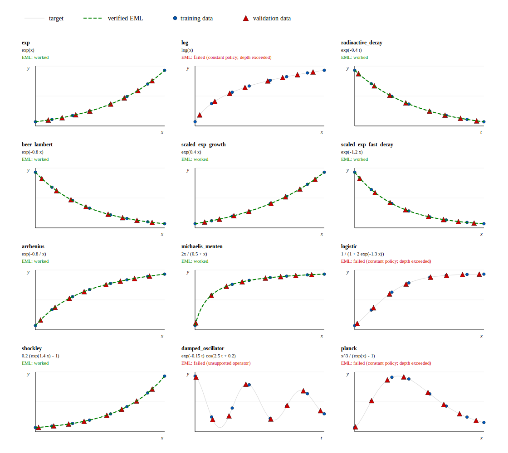

# EML Symbolic Regression

One binary operator can express a surprising amount of mathematics:

```text
eml(x, y) = exp(x) - log(y)
```

This project turns that idea into a symbolic-regression engine. Instead of asking a search algorithm to juggle a menu of operators like `+`, `*`, `/`, `exp`, `log`, and `sin`, it searches inside one regular family of EML trees. The system trains a soft tree, snaps it into an exact symbolic expression, cleans up the result, and then makes the verifier decide whether the formula was actually recovered.

The short version: it is a PyTorch-first, verifier-gated equation discovery package for compact elementary formulas.

## Current Evidence

The checked-in evidence run covers 12 target formulas under two settings: a basis-only compiler-policy track and a literal-constant warm-start track. It ran 24 configured rows with zero execution failures.

Nine rows passed the verifier. Fifteen were kept as unsupported by the declared compiler, depth, or operator gates. That is the current claim boundary: the project has reproducible evidence for shallow and explicitly seeded EML recovery paths, while broader blind recovery remains an open problem. The detailed campaign tables, manifests, baseline reports, and dataset manifests are checked in under `artifacts/`.

## The Trick

EML expressions are built from one repeated binary node:

```text
S -> 1 | eml(S, S)
```

For regression, variables such as `x` are added as terminals. A complete depth-bounded EML tree can then represent every EML expression up to that depth. That gives the optimizer one uniform search space instead of a mixed forest of operator-specific ASTs.

That does not make symbolic regression easy. It makes the search space regular enough to attack with a hybrid pipeline.

## How It Works

```text
data
  -> complete soft EML tree
  -> PyTorch complex128 optimization
  -> hardening and snapping
  -> exact EML AST
  -> symbolic cleanup
  -> verifier report
```

The engine has a few important moving parts:

- `complex128` training, because EML uses exponentials and principal-branch logarithms.
- Categorical gates over complete depth-bounded trees.
- Adam optimization with restarts, annealing, hardening, and snap manifests.
- Exact immutable EML expression trees with deterministic JSON serialization.
- A guarded compiler for a supported SymPy subset, useful for warm starts and diagnostics.
- Warm-start runs that embed an exact tree, perturb it, train it, snap it, and verify the result.
- SymPy cleanup for readable formulas.
- High-precision `mpmath` checks after training.

Training mode can use numerical safety guards. Verification mode is stricter: snapped formulas are evaluated again under the recovery contract.

## Target Curves And Data

The grid below plots the current target set with generated data splits. Each panel is labeled by function name and formula, and the axes are named without numeric tick labels. Blue dots are training data, red triangles are held-out validation data, and the black line is the target function. Green dashed curves are verified EML curves from recovered evidence rows. Gray dotted curves are the fixed exact EML trial `1`, shown only where no verified EML curve is available; they are not recovery claims.



## What Counts As Recovery

Training loss alone is not recovery.

A formula is `recovered` only when an exact candidate passes the verifier across:

- training data;
- held-out data;
- extrapolation data;
- high-precision checks.

Compiler output alone is not trained recovery. A compiler seed can prove that a formula is representable and can initialize a run, but it is not a discovery claim by itself.

Warm starts that return to their seed tree, scaffolded runs, refits, repaired candidates, compile-only checks, and unsupported cases are all separate evidence regimes. That separation is deliberate. It keeps a successful scaffolded or repaired result from being mistaken for blind discovery.

## Install

Python `>=3.11,<3.13` is supported.

```bash
python -m pip install -e ".[dev]"
```

The package installs a CLI:

```bash
eml-sr --help
```

## Quick Start

Verify the paper-grounded EML identities for `exp` and `log`:

```bash
eml-sr verify-paper
```

List built-in demos:

```bash
eml-sr list-demos
```

Compile a supported scientific-law demo into exact EML:

```bash
eml-sr demo beer_lambert --compile-eml --output beer-compile-report.json
```

Run a compiler warm-start path:

```bash
eml-sr demo beer_lambert --warm-start-eml --output beer-warm-report.json
```

Try a shallow blind EML training baseline:

```bash
eml-sr demo exp --train-eml --depth 1 --steps 80 --restarts 2 --output exp-trained.json
```

List benchmark suites:

```bash
eml-sr list-benchmarks
```

Run the small smoke benchmark:

```bash
eml-sr benchmark smoke
```

Run the full checked-in campaign suite:

```bash
eml-sr campaign paper-tracks --output-root artifacts/campaigns --label current-paper-tracks --overwrite
```

List expanded datasets:

```bash
eml-sr list-datasets
```

Run the matched baseline harness:

```bash
eml-sr baseline-harness --output-dir artifacts/baselines/current --overwrite
```

Run tests:

```bash
python -m pytest
```

## Demo Ladder

The demos favor normalized, dimensionless formulas with a useful mix of recognizability and feasibility:

- `exp` and `log`: identity checks for the core EML semantics.
- `beer_lambert`: exponential decay and a high-probability warm-start path.
- `radioactive_decay`: a simple scientific baseline.
- `shockley`: an electronics law close to EML's exponential-minus-constant bias.
- `arrhenius`: normalized reciprocal-temperature behavior, `exp(-0.8/x)`.
- `michaelis_menten`: saturation behavior, `2*x/(x+0.5)`.
- `logistic`: nonlinear growth, currently treated carefully as a harder diagnostic.
- `planck`: iconic normalized spectrum, currently a stretch diagnostic rather than a solved blind recovery.
- `damped_oscillator`: visually strong, but harder because it mixes decay and oscillation.

Arrhenius and Michaelis-Menten currently count as exact compiler warm-start evidence, not blind discovery. Planck and logistic stay in the stretch/unsupported bucket unless the strict compiler, warm-start, and verifier contracts pass.

## Evidence Labels

| Label | Meaning |
| --- | --- |
| `recovered` | An exact EML candidate passed verifier checks. |
| `blind_recovery` | Random or scaffold-free training snapped to an exact EML candidate that verified. |
| `trained_exact_recovery` | A post-training snapped exact EML AST verified. |
| `same_ast_warm_start_return` | A warm start returned to the same exact AST and verified. Useful basin evidence, not blind discovery. |
| `verified_equivalent_warm_start_recovery` | A warm start snapped to a different exact AST that still verified. |
| `compiled_seed` | The source formula compiled into exact EML and validated as a seed. |
| `verified_showcase` | A non-EML catalog formula verified for demo coverage; it is not EML discovery. |
| `repaired_candidate` | Cleanup repaired a failed exact candidate; this is repair evidence only. |
| `unsupported` | A depth, node, operator, compiler, warm-start, or verifier gate failed closed. |

## Boundaries

This is not a claim that arbitrary deep formulas can be discovered blindly. The reported behavior is much more specific:

- shallow blind recovery is plausible and testable;
- deeper random-initialized recovery gets hard quickly;
- warm starts can show that useful basins exist;
- compiler paths can prove representability and provide seeds;
- repairs can rescue some failed exact candidates, but they are still repair evidence;
- basis-only and literal-constant runs have separate denominators;
- every recovery claim belongs to the verifier, not the optimizer.

That is the point of the package: make symbolic-regression experiments over EML trees concrete, reproducible, and hard to overstate.
